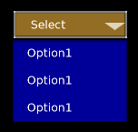

With the **DynamicLayout** component, you can change the number of children of the layout element at run time. To use the **DynamicLayout** component, you place it on an element that also has a [**LayoutColumn**](components-layout-column), [**LayoutRow**](components-layout-row), or [**LayoutGrid**](components-layout-grid) component. There are also other components like the [DropDown](/docs/user-guide/interactivity/user-interface/components/interactive/components-dropdown/) that already include a dynamic layout.

The layout element (1) dynamically resizes to fit its child elements. The first child (2) of the layout element acts as the prototype element. At run time, the UI system clones the prototype element to achieve the specified number of children in the layout.


The automatic resizing of the layout element depends on the layout type.

For [**LayoutColumn**](components-layout-column) and [**LayoutRow**](components-layout-row) elements, the layout element resizes in order to keep all of the child elements the same size as the prototype element.

For a [**LayoutGrid**](components-layout-grid) element, the cell size of the **LayoutGrid** component determines the size of the child elements. The **LayoutGrid** element's initial size determines the number of children that can fit in each row or each column, depending on fill direction or **Order** settings. If the **Starting with** fill direction is **horizontal**, the UI system uses the **LayoutGrid** element's initial width to determine how many children fit in each row. If set to **vertical**, the initial height is used to determine how many children fit in each column.


**To use a dynamic layout component**

1. In the [**UI Editor**](/docs/user-guide/interactivity/user-interface/editor), add a **LayoutRow**, **LayoutColumn**, or **LayoutGrid** prefab. To do this, choose **New**, **Element from Prefab**. Then select one of the layout elements.

   This serves as the structure or framework to hold your dynamic content.

1. Add a **DynamicLayout** component to your layout component. To do this, in the **Properties** pane choose **Add Component**, **DynamicLayout**.

   For **Num Cloned Elements**, enter the initial number of children to be created.

1. Create a child entity that has an **Image** component. To do this, right-click your layout component in the **Hierarchy** pane and choose **New**, **Element from Prefab**, **Image**.

   This image serves as the prototype element that will be cloned and filled with dynamic content.

---

**Cpp**

To create your own UI components, check the [Working with UI Components](/docs/user-guide/interactivity/user-interface/components/working/) page.

As mentioned above, the dynamic layout content is often part of other components such as the [DropDown](/docs/user-guide/interactivity/user-interface/components/interactive/components-dropdown/). This allows the dropdown to populate its [Options}(https://www.docs.o3de.org/docs/user-guide/interactivity/user-interface/components/interactive/components-dropdownoption/) dynamically, during runtime of the game or simulation.

 The following explanation and code examples expect you to already have a working a dropdown or another component that also uses a dynamic layout.

Once the component is available in the UI editor; and the UI dropdown (with a dynamic layout) is in the canvas; you can attach the cpp component to it.

Open your component header, include the UiDynamicLayoutBus and inherit from UiDynamicLayoutBus. In order to listen or handle one and only one address use ::Handler. In order to listen to multiple addresses use::MultiHandler. An EntityID is advised too so you can connect and disconnect the dynamic layout. SetNumChildElements is the event obtained through the inheritance. Here is an example of what you should have in your header:

```cpp
#pragma once

#include <AzCore/Component/Component.h>
#include <MyCustomGem/MyCustomExampleInterface.h> //interface should match your custom gem and component
#include <LyShine/Bus/UiDropdownBus.h> // or another component that also uses dynamic layout content
#include <LyShine/Bus/UiDynamicLayoutBus.h>

namespace MyCustomGem // namespace should match your custom gem
{
    class MyCustomExampleComponent: public AZ::Component, public MyCustomExampleRequestBus::Handler, private UiDropdownNotificationBus::Handler // or MultiHandler if you are want to listen to multiple events
    {
    private:
      AZ::EntityId m_DropDown;
      AZ::EntityId m_dpdContentUI;
      /// rest of the code...
    public:
      void SetNumChildElements(int numChildren);
      /// rest of the code...
    
```

Inside your cpp file you should connect your dropdown bus when the component is activated; and disconnect it when the component is deactivated. To evaluate if the event is working, run the UI editor. The dropdown should display 3 options instead of just one.

```cpp
    /// other code...
    void MyCustomExampleComponent::Activate()
    {
         MyCustomExampleRequestBus::Handler::BusConnect(GetEntityId());
         UiDropdownNotificationBus::Handler::BusConnect(m_DropDown); // or another component that also uses dynamic layout content 
    }
    void MyCustomExampleComponent::Deactivate()
    {
         MyCustomExampleRequestBus::Handler::BusDisconnect(GetEntityId());
         UiDropdownNotificationBus::Handler::BusDisconnect(m_DropDown); // or another component that also uses dynamic layout content
    }
    
    void MyCustomExampleComponent::OnDropdownExpanded()
    {
         /// Mock options for demonstration purposes
         AZStd::vector<AZStd::string>& options = { "Fireball", "Ice Shard", "Lightning Bolt" };

         /// This will clone the existing Option leaving 3 avaliable options to choose in the dropdown
         AZ::EntityId layoutEntityId = m_dpdContentUI;
         int desiredChildCount = static_cast<int>(options.size()); /// assuming it is a safe cast, since you own't exceed int32
         UiDynamicLayoutBus::Event(layoutEntityId, &UiDynamicLayoutInterface::SetNumChildElements, desiredChildCount);

         /// set the text-option. e.g. for first index: "Fireball"
         for (int i = 0; i < desiredChildCount; ++i)
         {
            AZ::EntityId childEntityId;
            UiElementBus::EventResult(childEntityId, m_dpdContentUI, &UiElementBus::Events::GetChildEntityId, i);
            AZStd::string entityIdStr = childEntityId.ToString();

            AZ::Entity* textEntityId = nullptr;
            UiElementBus::EventResult(textEntityId, childEntityId, &UiElementBus::Events::FindChildByName, m_TextOfTheOption);
            AZ::EntityId textEntityId2 = textEntityId ? textEntityId->GetId() : AZ::EntityId();
            AZStd::string entityIdStr2 = textEntityId2.ToString();

            UiTextBus::Event(textEntityId2, &UiTextBus::Events::SetText, options[i]);
         }
    }

    /// rest of the code...
```

In other words, the above code clones or copies the only Option available ("Option1") and populates the remaining childs with the clones giving this as the result. 



If you use the vector of strings that contains 3 indexes it will modify the text-element of each option and populate the dropdown as expected.


---

**Lua**

In Lua, there are code examples available in the official GitHub project as part of LyShineExamples. Here is an example for [MultiSelectionDropdown](https://github.com/o3de/o3de/blob/f17b405699c55400a985b8741af2649c39f11315/Gems/LyShineExamples/Assets/UI/Scripts/LyShineExamples/Dropdown/MultiSelectionDropdown.lua#L29)

--- 

**Outros**

The dynamic layout is often dependent on other UI-components that may or may not be ready when the above code is executed. If you are unsure when to populate the dynamic layout, consider doing it after all UI elements are loaded and ready. This is possible with the In-Game Post-activate event that can be consulted [here](/docs/user-guide/interactivity/user-interface/canvases/accessing-ui-canvas-runtime/).
